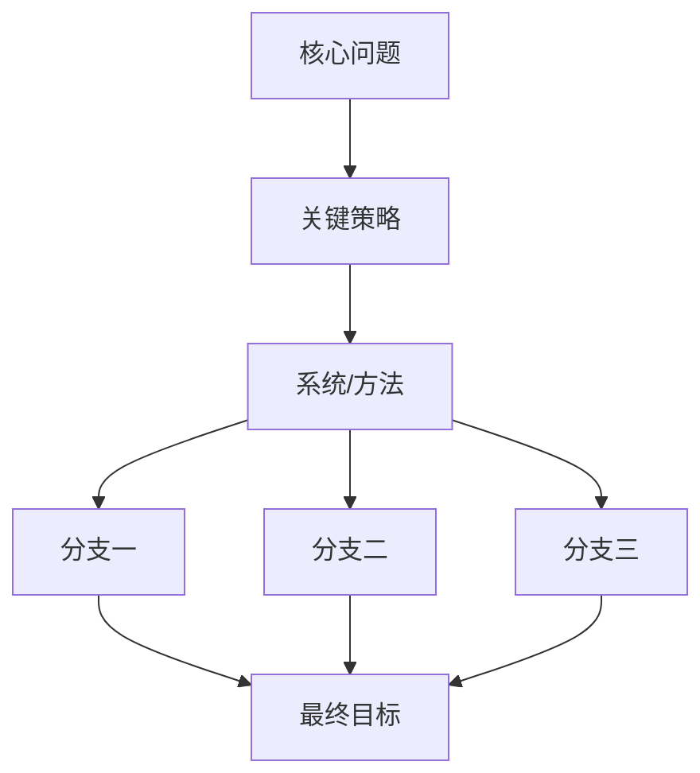

# Obsidian Clipping AI Summary

Use this skill when the user asks to整理、补充、重写、精简、归纳 `AI总结` for an Obsidian clipping, Bilibili note, transcript note, meeting clipping, or subtitle-derived note.

## Bilingual Source Archive Routing

If the user asks for `原文`, `提取原文`, `英文原文与中文译文`, English original plus Chinese translation, or says `不要总结` / `不要乱总结`, do not use this skill's summary workflow as the final deliverable. Use [`bilingual-source-archive`](../bilingual-source-archive/SKILL.md) instead, and use this skill only as a source-reading helper if needed.

## Canonical Chinese Technical Writing Gate

For `AI总结`, Feishu investigation pages, Mermaid labels, Chinese captions, and Chinese clipping summaries, also use [`chinese-technical-writing`](../chinese-technical-writing/SKILL.md). Keep source titles, method names, acronyms, datasets, and code names unchanged, but translate ordinary technical concepts into Chinese.

## Output Style

- Write in Chinese-first prose.
- Keep the `AI总结` useful but compact: usually 500-900 Chinese characters plus one small diagram.
- Prefer this structure:
  1. 1-2 paragraphs for the core thesis and context.
  2. `关键判断` with 3-5 short bullets when there are multiple takeaways.
  3. `主线图` with a compact vertical Mermaid graph whose node count follows the content complexity.
  4. `技术路线` or `内容脉络` with 3-4 numbered items.
  5. A short `启发` section only when the content has research/workflow implications.
- Use bold only for the few concepts that must be scanned quickly.
- Avoid Obsidian callouts unless the user explicitly asks for richer visual styling.
- Avoid long nested bullet trees and wide tables.

## Mermaid Diagram Rule

Use a vertical graph by default so the user does not need horizontal scrolling. The graph should be **complete enough to show the argument structure**, not merely a 4-node linear slogan.

Choose node count by content:

- Simple clipping: 4-6 nodes.
- Multi-section research/technical article: 7-10 nodes.
- Complex pipeline/system article: 8-12 nodes with 2-4 short branches.

Use branches when the source has parallel components, such as multiple modules, evaluation axes, or future directions. Keep labels short and avoid dense sentences inside nodes.

Use this centered template pattern:

````markdown

````

Keep node labels short. Prefer vertical flow with modest branching. Do not force every diagram into exactly five nodes; the diagram should preserve the source's main idea and its core branches while remaining readable in one screen.

## Editing Workflow

1. Read the note and identify `## AI总结`, `## 笔记`, and `## 字幕`.
2. If `AI总结` is empty, fill it. If it exists, revise it in place.
3. Preserve original subtitles and metadata.
4. If the clipping title is still `Untitled`, rename the file to the real title after confirming the frontmatter/title.
5. Verify with `sed` or `rg` that the final `AI总结` section contains the summary and that the Mermaid block is vertical.

## Feishu Sync Routing

When the user asks to整理进飞书 / 同步进飞书 for a clipping:

- Do not blindly put every clipping under `Clippings`. Choose the Feishu destination by material role.
- Use `Clippings` for ordinary saved articles, lightweight videos, and source-preserving archive pages.
- Use `Investigation` for research-direction materials, technical talks, route evidence, survey-like synthesis, or content that should inform the user's world-model / embodied-world-model research plan.
- For `Investigation` pages, write a distilled learning page rather than dumping the full transcript: source metadata, one-sentence conclusion, core thesis, technical route, route relevance, open questions, and a compact Mermaid mainline diagram.
- Keep the original source URL and BVID / upload date when available.
- Remove Obsidian-specific residue before writing to Feishu: frontmatter fences, iframe embeds, local paths, `![[...]]`, raw timestamp spam, and `图像： EW_IMG...` labels.
- After writing, fetch the Feishu page and verify title, parent placement, key content, and absence of Obsidian residue.

## Balance Rules

- If the user says "太单一", add a small diagram, short bullets, and moderate bold.
- If the user says "太丰富", remove callouts, reduce bullets, and shrink the diagram.
- If the user says "太精简", add one compact `关键判断` block or expand each route by one sentence.
- If the user says "流程图太简单", increase node count and add branches based on the content's real structure, while keeping the graph vertical and readable.
- Prefer a stable middle point: readable in one screen, but not reduced to only slogans.
