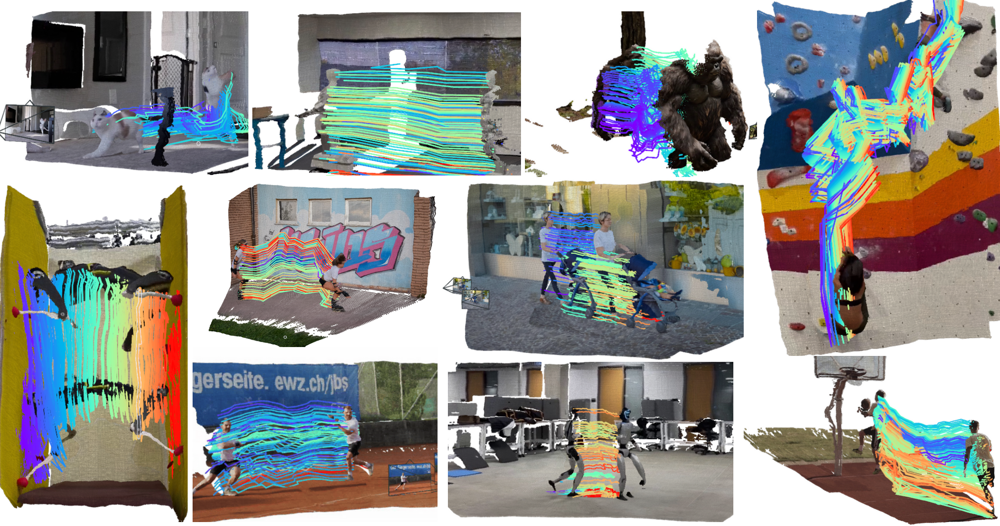
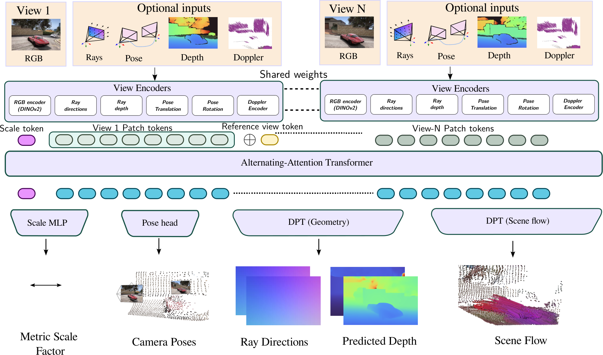

# Any4D：用户认可的 Teaser 与方法总览参考

用户于 2026-09-22 明确认可这篇论文的 teaser 和 pipeline overview 的配色与表达方式。后续绘制相关科研图时，优先检查这组参考是否适用；根据当前论文决定内容、分支与布局，不机械套用。

## 来源与原图

- 论文：Any4D: Unified Feed-Forward Metric 4D Reconstruction。
- 用户提供：[PDF](https://arxiv.org/pdf/2512.10935)。本参考固定使用 [arXiv HTML v1](https://arxiv.org/html/2512.10935v1)，避免后续版本改变图号或样式。
- Figure 1：[本地 teaser](teaser.png)，[官方原图](https://arxiv.org/html/2512.10935v1/cvpr_teaser.png)。
- Figure 3：[本地方法总览](overview.png)，[官方原图](https://arxiv.org/html/2512.10935v1/any4d_architecture_v3.png)。
- 两图均直接下载自论文 HTML，未重绘、裁切或重新编码。HTML 标注论文许可为 CC BY-SA 4.0；这些文件是外部论文参考素材，不属于 Sivia 的 MIT 原创资产。对外再分发或改编时保留来源并核对适用许可。

开始设计前实际查看两张图片。以下为对可见视觉特征的分析，不是作者提供的设计规范。

## Teaser：让结果本身承担表达

- **主体是三维重建与运动轨迹。** 使用真实的场景几何、人物运动、相机视锥和局部输入图，让读者直接看到方法输出。
- **白底与不规则场景轮廓。** 结果顺着重建边界呈现，场景之间用白色留隙分隔，没有厚重卡片背景和统一外框。
- **大小错落但有整体秩序。** 中央较宽的结果与两侧较高的场景交错排布；横向运动和纵向运动分别利用不同形状的区域。不要把当前论文强行塞进同样数量的示例。
- **灰度较低的场景底图承托鲜明轨迹。** 蓝紫、青绿、黄橙的轨迹是主要视觉焦点。保留原数据的颜色定义；不能仅凭图像推断每种颜色精确对应的时间或物理量。
- **少字、强证据。** 图内几乎没有方法说明，能力与适用场景通过多个真实结果展示。具体指标、设置与必要解释放在图注。

适用于已有高质量重建、跟踪或动态结果的能力展示。尚无实验结果时，可以画明确标注的概念示意，但不能生成假结果冒充这类 teaser。

## Pipeline Overview：分层、对称、语义配色

读图顺序从上到下：多视图与可选传感输入 → 各模态编码 → token 序列 → 共享主干 → 分支预测头 → 可见输出。

- **顶层左右呼应。** View 1 与 View N 代表多视图，重复结构通过共享权重连线与省略号压缩。可选输入有清晰分区，不会被误读成全部必需。
- **横向主干统一全图。** 中部主干占据一整条横带，让多分支汇聚关系成为视觉中心；上下的 token 行表达中间表示。
- **预测头与结果垂直对齐。** 尺度、位姿、几何和场景流各有位置，箭头直接落到对应结果。几何分支有两个结果，因此不能把它误拆成两个独立预测头。
- **颜色按角色复用。** 编码器容器、主干和预测头复用浅紫填充与深绿边框；输入用浅桃色，表示变化用灰绿与青色，特殊 token 用少量醒目颜色。
- **图形对象具有含义。** 相机视锥表达视线和姿态；深度图与点云展示数据类型；圆角单元代表 token。只在当前方法存在这些对象时使用。
- **连接语法克制。** 实线箭头表达明确流向，虚线表达共享权重，点线表达省略的重复序列。不可把这些线型混用为装饰。
- **浅背景、细轮廓、黑色标签。** 大标签采用衬线外观，编码器内的小标签采用无衬线粗斜体；这是可借鉴的层级对比，不要求新图照搬混排字体。中文需选择实际支持中文的字体并检查缩小后的可读性。

原图部分层间依靠位置暗示连接。新方法若有容易误读的分支，应补必要箭头，而不是为了相似度继承歧义。

## 可复用配色

下列 HEX 来自本地 overview.png 的实际 RGB 像素统计；不是凭印象估计。它们是这个案例的色板，不是所有科研图的硬性配色。

| 视觉角色 | HEX | 用法 |
| --- | --- | --- |
| 画布 | `#FFFFFF` | 保持大面积白底与留隙 |
| 输入区域 | `#FCECD9` | 浅桃色，区分观测端 |
| 主要模块填充 | `#ECE8FE` | 编码器、主干、预测头复用 |
| 主要模块边框 | `#155044` | 深绿色，统一模块轮廓 |
| 表示区域浅底 | `#E4F7F3` | 部分输入 token 的分组底色 |
| 输入 token | `#BBCAC0` | 灰绿表示，与输出 token 区分 |
| 输出 token | `#60C9E3` | 青色强调经过主干的表示 |
| 输出 token 轮廓 | `#004454` | 深青色轮廓 |
| 尺度 token | `#E994FE` | 少量高饱和点缀，标识特殊角色 |
| 输入区域边线 | `#D4D4FF` | 轻量分区轮廓 |

复用时先建立“角色 → 颜色”映射，减少不需要的颜色；不要给每个模块分配一种新颜色。轨迹或深度的连续色图属于数据编码，与模块分类配色分开管理。

## 后续生成或可编辑绘制时

1. 根据用途选 teaser、方法总览，或分别设计两图；不要把所有方法细节堆进结果展示图。
2. 打开对应原图，将其作为实际视觉参考，并在设计说明中记录借鉴了哪些特征。
3. 根据当前论文建立输入、操作、输出与证据关系，再选择分区比例、分支数量和箭头。Any4D 的网络结构、指标与实验结果不迁移到其他论文。
4. 可编辑图中，标签、模块、连线、token 与简单相机示意用原生对象；真实重建、深度和点云结果作为独立图像资产。不要把整张参考 PNG 当作已完成的可编辑图。
5. 按实际论文版宽检查标签、分支、缩略结果和白色间隔。保持主要输出可辨识，并核对颜色和线型含义。

本案例未附“原作者生成 prompt”，因为没有这样的已知来源。后续如编写适配 prompt，应标注为根据参考新写的设计指令。
